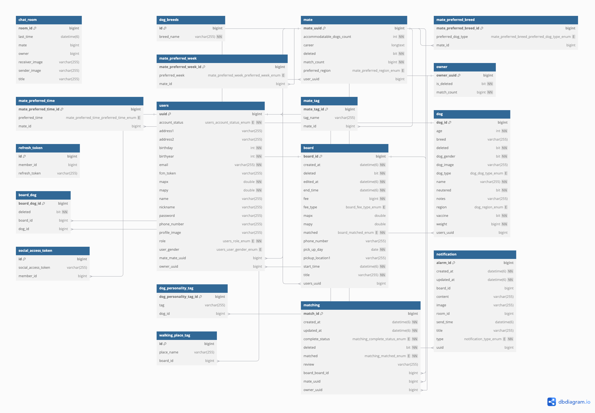

<h1 align="center">Welcome to 같이걷개 </h1>

    

> 같이걷개 (비사이드 프로젝트)

## ✨ Description

---

>최근 직장인이나 학생들 사이에서 "펫미(Pet = Me)족", 즉 반려견을 가족처럼 여기는 문화가 확산되고 있습니다. 하지만 낮 시간 동안 반려견을 혼자 두는 것에 대한 걱정과 더불어, 돌봄 서비스나 호텔 이용에 따른 높은 비용 부담이 문제가 되고 있습니다. 이러한 문제를 해결하기 위해 반려동물과 산책 메이트를 연결하는 매칭 플랫폼 "같이걷개"를 기획하게 되었습니다. 이 플랫폼은 사용자들에게 새로운 일자리를 제공함과 동시에, 반려동물의 복지를 향상시키는 것을 목표로 합니다.

## Team

---
FrontEnd 2명, BackEnd 1명, Designer 2명, 기획/PM 1명

## Tech Stack

---

Backend: Java, Spring Boot, Spring Security, OAuth2, JPA, JWT, Redis, WebSocket

Database: MySQL (AWS RDS)

Cloud Services: AWS EC2, S3, ACM, Route53, ALB, FCM

CI/CD: Git Actions, Docker

Performance Test : Jmeter

## System Architecture

---

[//]: # ([![stackticon]&#40;https://firebasestorage.googleapis.com/v0/b/stackticon-81399.appspot.com/o/images%2F1732620980855?alt=media&token=0aa05b9b-ea57-49d5-88ca-63142b98bb70&#41;]&#40;https://github.com/msdio/stackticon&#41;)

## :pencil2: ERD

---

# :mag: 서비스 기능

## 공통 기능

## 계정
- 소셜로그인만 가능
- 중복 로그인 시 가장 최근 로그인 유저만 유지

### 알림함
- 생성일 기준 14일 동안 유지 후 자동 삭제.
- 주요 알림:
    - 산책 매칭 요청 및 수락 알림.
    - 산책 관련 알림 (예: 산책 시간 변경, 취소).
- 알림은 제목과 상세 내용을 포함하여 사용자에게 제공.

### 프로필 카드
- 등록된 산책 메이트 또는 반려견의 프로필을 랜덤으로 노출.
- 선택하여 세부 정보를 확인하거나 매칭 진행 가능.

## 채팅

### 채팅방
- **정렬 기준**:
    - 1순위: 읽지 않은 메시지가 있는 채팅방.
    - 2순위: 읽은 메시지가 있는 채팅방.
- **안 읽은 메시지 표시**:
    - 채팅방 목록과 채팅방 내부에서 안 읽은 메시지 개수 제공.
- **채팅방 삭제**:
    - 사용자가 선택한 특정 채팅방 삭제 가능.

### 메시지 기능
- **텍스트 메시지 입력**:
    - 사용자 간 텍스트 기반 메시지 송수신.
- **메시지 보낸 시간 표시**:
    - 각 메시지에 발송 시간 표시.

### 파일 전송
- **사진 전송**:
    - 채팅방 내 카메라 기능으로 실시간 사진 전송 (최대 2MB).
- **카메라 접근 및 사용**:
    - 채팅방에서 카메라 아이콘 클릭으로 사진 촬영 및 전송 가능.

## 보호자 모드
### 홈
- **홈 배너**: 반려견의 산책 활동을 슬라이드 배너로 시각적으로 확인.
- **산책 메이트 프로필 카드 목록**: 등록된 산책 메이트 프로필을 랜덤으로 노출.

### 산책 관리
- **산책 스케줄 관리**: 반려견의 산책 일정을 등록, 수정, 삭제 가능.
- **산책 기록 보기**: 날짜별로 과거 산책 기록 조회.

### 매칭 관리
- **산책 메이트 매칭 요청**: 원하는 산책 메이트에게 매칭 요청 가능.
- **산책 메이트 검색** : 초성 입력시 자동 키워드 완성 가능.
- **매칭 내역 관리**: 과거 매칭 내역 확인 및 진행 중인 매칭 상태 조회.

### 반려견 프로필 관리
- **프로필 등록/수정**: 반려견의 이름, 나이, 품종, 특이사항 등을 입력/수정.
- **사진 업로드**: 반려견 사진 추가로 프로필 완성 가능.

## 산책 메이트 모드
### 홈
- **홈 배너**: 산책 메이트의 산책 활동을 슬라이드 배너로 시각적으로 확인.
- **반려견 프로필 카드 목록**: 등록된 반려견 프로필을 랜덤으로 노출.
  - 반려견 견종 초성 입력시 자동 키워드 완성

### 산책 관리
- **산책 제안**: 보호자에게 산책 제안을 보내 날짜와 시간 조율.
- **산책 기록 관리**: 참여한 산책 기록 조회 및 관리 가능.

### 매칭 관리
- **매칭 요청 확인**: 보호자에게 받은 매칭 요청을 수락/거절.
- **매칭 상태 관리**: 진행 중인 매칭 상태를 확인하고 보호자와 소통.

### 프로필 관리
- **프로필 설정**: 이름, 활동 가능 시간, 지역 등의 정보를 등록/수정.
- **사진 업로드**: 자신의 사진 추가로 프로필 완성 가능.

# 주요과정

---

## 협업 과정

- 애자일 방식의 회의 및 피그마 와 엑셀을 사용한 문서 공유
  ([프로젝트 명세서](https://docs.google.com/spreadsheets/d/1VBapu7mr89ujvRpVGxLbJw6wNkxU-_CEoCnUFgFYw0M/edit?usp=sharing) / 
[피그마 명세서](https://www.figma.com/design/7X1mnbaM8zmJY1Kc02SOfv/%EA%B0%99%EC%9D%B4%EA%B1%B7%EA%B0%9C?node-id=0-1&t=406YOQg0NFmoyYaX-1))
  - 팀원이 주차별 팀원간 목표 달성 정도를 공유
  - 이슈 발생 부분에 대해 토론하고 정책에 대해 결정
- swagger를 사용한 API 문서 명세화
- 백엔드 팀원과 깃허브를 사용한 이슈 관리
  - main과 develop 브랜치를 분기, 파생한 브랜치로 각 팀원간 맡은 기능을 구현
  - 이슈를 작성하여 작업중인 건 확인
  - PR을 통한 코드 리뷰 및 소통

## 내가 기여한 부분

- 레이어 아키텍처의 **강한 의존성 문제** 개선
- JPA를 사용한 영속성 엔티티 관리
- 예외 응답을 처리할 수 있는 클래스 구현, ExceptionHandler를 사용하여 예외처리 로직 공통 처리
- Spring Security와 Jwt를 사용한 인증 방식 구현
- AOP를 사용한 각 컨트롤러 및 서비스 레이어의 로깅 공통 로직 중복 제거
- OAuth2를 사용한 소셜 로그인 구현
- 중복 로그인을 처리할 수 있는 Filter와 인증을 거칠 수 있는 Filter를 OncePerRequestFilter를 상속받아 구현
- Redis의 **ZSet** **트라이 구조**를 사용한 실시간 초성 검색 자동완성 기능 개발
- **STOMP**와 **Websocket**을 사용한 실시간 채팅 기능 개발
  - 유저의 마지막 접속 시간을 Redis 캐시에서 로드하여 이후 시간의 미수신 메시지 클라이언트에 반환 
  - EventListener, JWT Token을 사용하여 유저 로그인 세션 접속유무 실시간 Redis에 캐싱처리
  - 미접속 유저는 FCM을 사용한 실시간 알림 전송

## 배포 과정

- CI/CD 파이프라인: Git Actions와 Docker를 이용해 코드 변경 시 자동 빌드 및 배포.
- AWS 설정:
  - Route53으로 도메인 네임 관리.
  - ACM 및 ALB를 활용한 SSL 인증 및 포트 리다이렉션 구성.
  - EC2와 RDS(MySQL) 기반의 안정적인 서버 환경 구축.

## 프로젝트 개선점

### 실시간 초성 검색 자동완성 기능 개발
- MySQL의 LIKE 함수를 사용한 키워드 검색 방식에서 성능 개선을위해 Redis ZSet을 사용하였습니다. 
- 이 과정에서 애플리케이션 초기화단계에 @PostConstruct를 사용한Init()메서드에서 모든 유저와 반려견 견종 데이터를 음절로 쪼개어 저장해야 하는 로직이 수행되었고 이로 인해 애플리케이션 작동 시간이 지연된다는 단점이 있었습니다. 
- 해당 로직을 개선하기 위해 Trie 알고리즘을 적용하여 초기에 한 번 모든 데이터를 조회한 이후에는 저장소의 조회 없이 Trie내 노드를 사용한 조회를 수행할 수 있도록 개선하였고 결과적으로 1만번의 요청이 들어왔을때 9만개의 더미데이터에서 18.85초에서 7.02초로 약 11초 시간을 단축시키는 성능 개선의 결과를 보였습니다.
- [키워드 초성 검색 기능 개선 과정](https://sunro1994.tistory.com/267)을 블로그에 기록해두고 꾸준히 개선사항을 업데이트 하였습니다.

### 아키텍처 개선
- 무분별하게 생성하고 상속받아 사용하는 인터페이스를 제대로 공부하고 어댑터 패턴으로 개선하였습니다.
- 프로젝트를 확장가능하도록 의존성을 약화시키고 각 레이어의 연결 인터페이스를 port패키지로 모아 의존성 관계를 명확히 볼 수 있도록 구조를 정리했습니다.[레이어 아키텍처 구조 개선하기](https://sunro1994.tistory.com/255)

### JPA 영속성 관리
- JPA에서 무분별하게 사용하던 SoftDelete방식의 데이터 삭제 관리와 Cascade설정의 관계를 명확히 알고 잘못된 엔티티 설정들을 개선해 나갔습니다.([CallBackCycle을 사용한 연관 엔티티 삭제](https://sunro1994.tistory.com/260))

## 프로젝트 진행 과정 중 어려웠던 부분
1. Matching요청 시 상세 조건 검증
   
  - Matching 요청 시 견주(Owner)의 반려견(Dog)이 해당 매칭 요청 시간에 동일한 다른 매칭이 성사되어 있는지 확인과 산책메이트(Mate)의 일정이 해당 매칭 요청시간대와 중복되는 일정이 있는지 두 가지의 검증이 필요했습니다.
   - Mate의 일정 중복을 체크하기 위해 Mate와 Board테이블을 조인하고 Where절에 게시판의 산책 요청 시작시간부터 종료시간이 기존 일정에 중복되는 것을 조건으로 가져오도록 설정하였습니다. 이 쿼리를 통해 하나라도 데이터가 들어있다면 매칭 요청에 대해 예외를 발생시키고 클라이언트에서 메세지를 반환하도록 설정하였습니다.
   - Owner의 Dog엔티티또한 Board와 BoardDog, Match테이블을 Join하고 Where 조건절에서 다른 게시판과 시간대가 중복되는 것을 조건으로 가져오도록 수행하였습니다.
   - 위 두개의 쿼리에서 하나라도 중복되는 부분이 있다면 예외처리를 하여 유저들이 매칭하는데 혼동을 빚는 일이 없도록 비즈니스 로직을 만들었습니다.

2. 채팅 미접속 유저 체크 및 알람 전송
- 처음 Websocket과 STOMP, Redis의 Sub/Pub, Firebase를 사용하여 구현하는데 많은 경험을 할 수 있었습니다. 
- HTTP통신이 아닌 Websocket통신을 구현하면서 가장 어려웠던 부분은 유저의 접속 유무 판단 및 미접속시 FCM을 전송하고 접속시에는 채팅메세지만 보내야 하는 요구사항 이었습니다.
- @EventListenr를 사용하여 유저의 å접속및 해제를 감지하였고, Session 정보를 유저의 헤더 토큰에서 추출한 유저 Id, 유저의 접속상태("online","offline)값을 함께 Redis에 저장하였습니다. 
- 이를 이용하여 채팅 전송 비즈니스 로직에서 유저의 접속 유무를 판단하여 온라인일 경우 채팅을 전송하고 오프라인일 경우 FCM을 통해 알람을 보내는 방식을 구성하였습니다.

